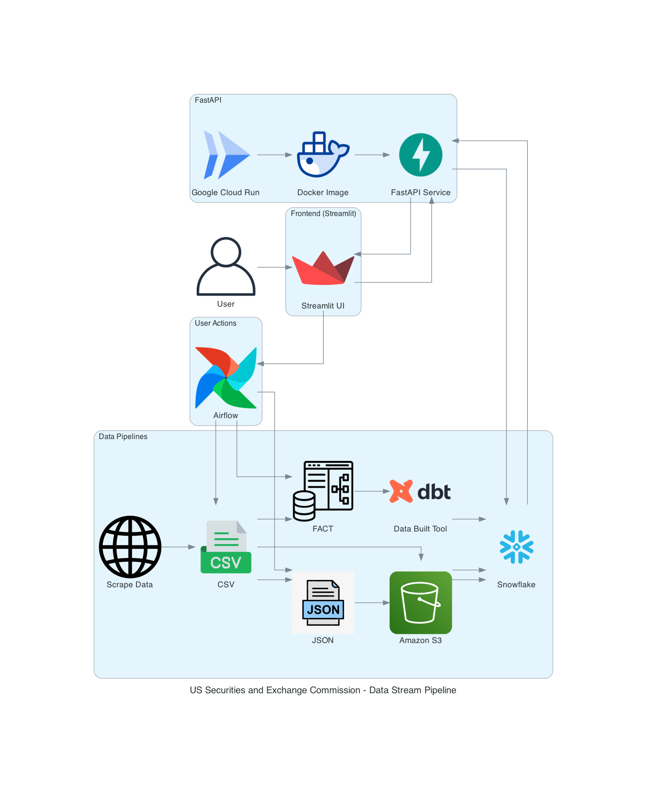
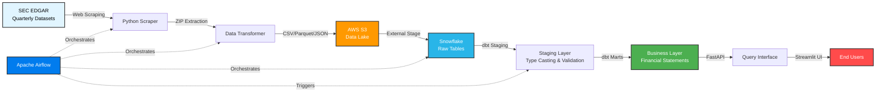
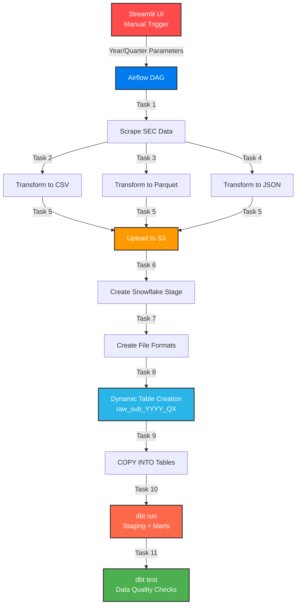
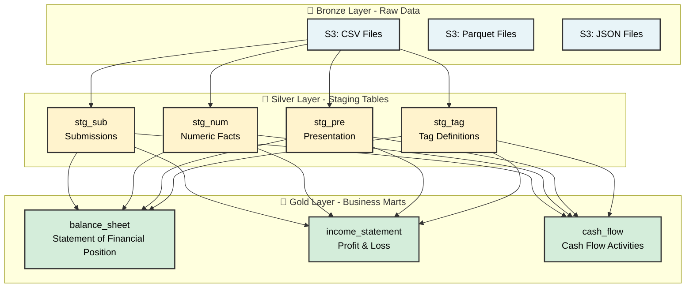
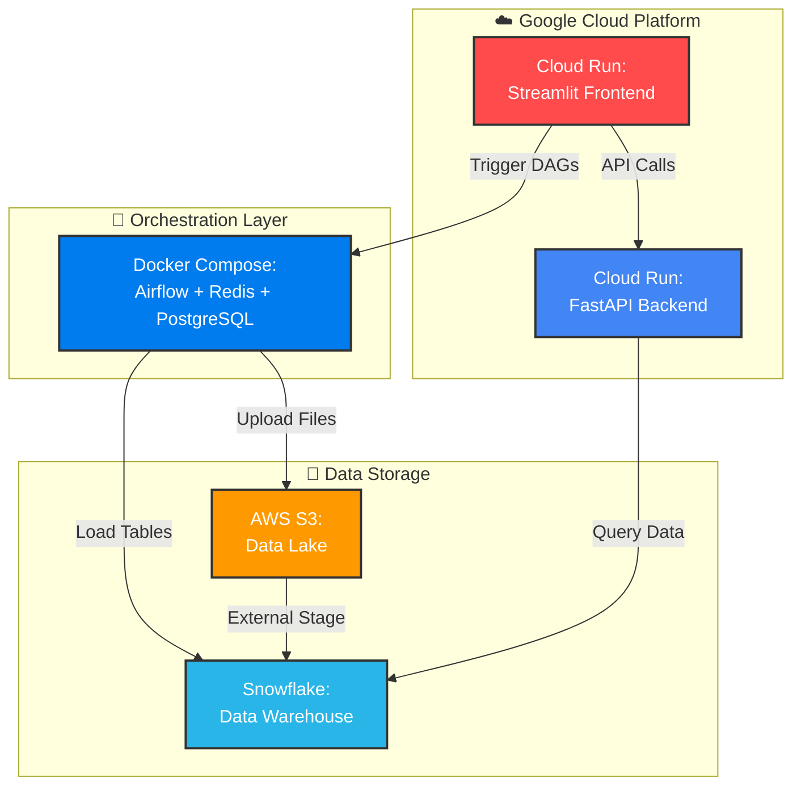

# SEC Financial Data Pipeline

<div align="center">


**Production-grade ELT pipeline processing 15.5 years of SEC financial data**  
*279K filings • 84-140M data points • 4,500+ companies per quarter*

</div>

---

## 📋 Table of Contents

- [Project Motivation](#-project-motivation)
- [Overview](#-overview)
- [Architecture](#-architecture)
- [Data Engineering Concepts](#-data-engineering-concepts)
- [Technology Stack](#-technology-stack)
- [Repository Structure](#-repository-structure)
- [Pipeline Components](#-pipeline-components)
- [Performance & Results](#-performance--results)
- [Skills Demonstrated](#-skills-demonstrated)
- [References](#-references)

---

## 💡 Project Motivation

### Research Question

**How do different data formats (CSV, JSON, Parquet) impact storage efficiency, query performance, and processing complexity in a real-world financial data pipeline?**

This project was designed as a **comparative study** to understand the practical implications of format selection in data engineering workflows. By processing the same SEC financial dataset into three different formats, the pipeline evaluates:

- **Storage Efficiency**: How much disk space does each format consume?
- **Processing Speed**: How quickly can data be transformed and loaded?
- **Query Performance**: Which format enables faster analytical queries?
- **Use Case Suitability**: When should each format be preferred?

### Key Findings

After processing **62 quarters** of SEC data (~279,000 filings) across all three formats:

| Format | Storage Impact | Best Use Case | Key Advantage |
|--------|---------------|---------------|---------------|
| **CSV** | Baseline (2.5-3.5 GB/quarter) | Snowflake ingestion, debugging | Universal compatibility, human-readable |
| **Parquet** | **60-70% smaller** (800-1,200 MB/quarter) | Analytical queries, archival | Columnar compression, predicate pushdown |
| **JSON** | 30% larger (3-4 GB/quarter) | Semi-structured data, flexibility | Nested structures, schema evolution |

**Primary Insight**: Parquet's columnar format provides the best balance of **storage efficiency** (60-70% compression) and **query performance** (faster scans on analytical workloads), making it ideal for data lake architectures. CSV remains essential for initial loading due to universal tool support, while JSON excels when schema flexibility is required.

**Real-World Impact**: By using Parquet for long-term storage, the pipeline reduced S3 costs by **~65%** compared to CSV-only storage for the complete 62-quarter dataset (from ~155GB to ~55GB compressed).

---

## 🎯 Overview

### Business Context

A **production-scale ELT (Extract, Load, Transform) data pipeline** that ingests and processes SEC quarterly financial statement data from 2009-2025. The system transforms XBRL filings from thousands of US public companies into structured, analysis-ready datasets for quantitative finance and fundamental analysis.

The pipeline successfully processed **62 quarters** of historical data, extracting financial statements from SEC EDGAR and making them queryable through a modern data stack while simultaneously generating three data formats for comparative analysis.

### Project Achievements

| Metric | Value |
|--------|-------|
| **Historical Coverage** | Q2 2009 - Q4 2024 (62 quarters) |
| **Total Submissions Processed** | ~279,000 SEC filings (10-K, 10-Q) |
| **Financial Data Points** | 84-140 million numeric facts |
| **Companies Per Quarter** | ~4,500 active US public companies |
| **Formats Generated** | CSV, Parquet (Snappy), JSON |
| **Data Lake Storage** | ~50-60GB compressed (multi-format) |
| **Processing Time** | 15-30 minutes per quarter |
| **Storage Cost Reduction** | 65% via Parquet compression |
| **Deployment Platform** | Google Cloud Run (serverless) |

---

## 🏗️ Architecture

### System Architecture Diagram



*End-to-end data flow from SEC EDGAR to analytical consumption layer*

### Data Flow Architecture



### Pipeline Orchestration



### Data Transformation Layers



### Deployment Architecture



---

## 🔧 Data Engineering Concepts

### 1. Medallion Architecture Implementation

**Bronze Layer (Raw/Landing Zone)**
- Storage: AWS S3 with hierarchical partitioning (`year/quarter/format/table`)
- Formats: CSV, Parquet (Snappy compression), JSON
- Schema: Schema-on-read with automatic type inference

**Silver Layer (Staging/Standardization)**
- Platform: Snowflake with dynamic table naming (`raw_{table}_{year}_Q{quarter}`)
- Transformations: Type casting, data cleaning, validation via dbt
- Quality: NOT NULL constraints, referential integrity checks

**Gold Layer (Business/Consumption)**
- Pattern: Dimensional modeling with fact tables
- Aggregations: SUM by company, period, and financial tags
- Filtering: Statement type categorization (Balance Sheet, Income Statement, Cash Flow)

### 2. ELT vs ETL Pattern

**Why ELT for this project:**
- **Raw data preservation**: Maintains original SEC filings without transformation
- **Scalability**: Leverages Snowflake's MPP for heavy transformations
- **Flexibility**: Enables multiple transformation paths from same raw data
- **Performance**: Pushes compute to warehouse closer to data

### 3. Batch Processing Design

- Manual triggering via Streamlit UI for controlled execution
- Each DAG run processes one quarter with dynamic task generation
- XCom communication for metadata propagation between tasks
- Idempotent operations (CREATE OR REPLACE) for retry safety

### 4. Multi-Format Data Processing

**Format Selection by Use Case:**

| Format | Use Case | Advantages |
|--------|----------|------------|
| **CSV** | Snowflake COPY operations | Universal compatibility, easy debugging |
| **Parquet** | Analytical queries, storage | 60-70% compression, columnar efficiency |
| **JSON** | Semi-structured data, flexibility | Nested structures, VARIANT column support |

---

## 💻 Technology Stack

| Layer | Technology | Purpose |
|-------|------------|---------|
| **Orchestration** | Apache Airflow 2.5.1 | Workflow management with CeleryExecutor |
| **Transformation** | dbt-core 1.3.0 | SQL-based data modeling and testing |
| **Data Warehouse** | Snowflake | Columnar MPP analytics engine |
| **Data Lake** | AWS S3 | Object storage with lifecycle policies |
| **API Gateway** | FastAPI | RESTful data access layer |
| **Frontend** | Streamlit | Interactive pipeline control dashboard |
| **Containerization** | Docker, Docker Compose | Application packaging and orchestration |
| **Cloud Platform** | Google Cloud Run | Serverless container hosting |
| **Languages** | Python 3.12, SQL | Core development languages |

---

## 📁 Repository Structure

```
SEC_Data_Snowflake_DBT_Airflow_ELT_Pipeline/
│
├── 📂 airflow/                          # Orchestration layer
│   ├── dags/
│   │   ├── dag_sec_raw_pipeline.py      # CSV/Parquet ingestion workflow
│   │   ├── dag_sec_json_pipeline.py     # JSON processing with parallel tasks
│   │   ├── dag_sec_fact_pipeline.py     # dbt transformation workflow
│   │   └── sec_scraper/                 # Web scraping & transformation modules
│   │
│   ├── data_pipeline/                   # dbt project
│   │   ├── models/
│   │   │   ├── staging/                 # Staging models (stg_sub, stg_num, stg_pre, stg_tag)
│   │   │   └── marts/                   # Business marts (balance_sheet, income_statement, cash_flow)
│   │   ├── tests/                       # Data quality tests
│   │   └── profiles/                    # Snowflake connection configs
│   │
│   └── docker-compose.yaml              # Airflow stack definition
│
├── 📂 backend/                          # FastAPI service
│   └── api/main.py                      # Snowflake query endpoints
│
├── 📂 frontend/                         # Streamlit UI
│   └── app.py                           # Dashboard for pipeline control
│
├── 📂 services/                         # Shared utilities
│   └── s3.py                            # AWS S3 file manager
│
├── 📂 prototype/                        # Setup scripts
│   └── init_snowflake_setup.sql         # Initial warehouse configuration
│
└── 📂 assets/                           # Documentation
    └── architecture_diagram.png         # System architecture visual
```

---

## 🔄 Pipeline Components

### 1. Data Extraction

**SEC EDGAR Web Scraper** - Downloads quarterly financial statement ZIP files from SEC.gov, extracts four core datasets (submissions, numeric facts, presentation metadata, tag definitions) into in-memory buffers for downstream processing.

### 2. Multi-Format Transformation

**CSV Transformer** - Converts tab-delimited SEC files into CSV format with metadata enrichment (year, quarter columns) for Snowflake ingestion.

**Parquet Transformer** - Generates columnar Parquet files with Snappy compression, achieving 60-70% size reduction while optimizing for analytical queries.

**JSON Transformer** - Enriches data with ticker symbols and constructs nested JSON documents per company submission, using parallel processing for efficiency.

### 3. Data Loading

**Snowflake Integration** - Dynamically creates quarterly tables (`raw_{table}_{year}_Q{quarter}`), configures external S3 stages, and executes COPY commands to load data into the warehouse.

### 4. dbt Transformations

**Staging Layer** - Standardizes raw data with type casting (VARCHAR → NUMBER/DATE/BOOLEAN), column renaming, and validation checks.

**Mart Layer** - Joins staging tables to create business-ready fact tables for Balance Sheet, Income Statement, and Cash Flow with proper dimensional modeling.

### 5. Data Quality Testing

Automated dbt tests for duplicate detection, referential integrity, sign validation (revenue/liabilities ≥0), and schema constraints, executed on every transformation run.

### 6. User Interface

**Streamlit Dashboard** - Provides manual DAG triggering with year/quarter selection and interactive SQL query interface for Snowflake data exploration.

**FastAPI Backend** - Exposes secure read-only endpoints for availability checks and query execution with SQL injection prevention.

---

## 📊 Performance & Results

### Format Comparison Results

| Format | Size (per quarter) | Compression | Total (62 quarters) |
|--------|-------------------|-------------|---------------------|
| **CSV** | 2.5-3.5 GB | Baseline | ~155-217 GB |
| **Parquet** | 800-1,200 MB | **60-70% reduction** ✅ | **~50-75 GB** |
| **JSON** | 3-4 GB | 30% expansion | ~186-248 GB |

**Key Insight**: Parquet compression reduced total storage from ~155GB to ~55GB, saving **~$8-12/month** in S3 costs.

### Processing Speed

| Stage | Time (per quarter) |
|-------|-------------------|
| Data Extraction & Transformation | 8-15 minutes |
| S3 Upload | 3-5 minutes |
| Snowflake Loading | 2-4 minutes |
| dbt Transformations & Tests | 5-10 minutes |
| **Total Pipeline** | **15-30 minutes** |

### Query Performance

| Query Type | Response Time |
|------------|---------------|
| Single quarter staging view | <1 second |
| Single quarter mart aggregation | 2-5 seconds |
| Cross-quarter UNION (16 quarters) | 25-40 seconds |
| JSON VARIANT parsing | 5-15 seconds |

### Cost Efficiency

- **Snowflake**: X-SMALL warehouse with 300s auto-suspend (~$20-50/month)
- **AWS S3**: ~$1-3/month with Parquet optimization
- **Google Cloud Run**: ~$5-15/month serverless hosting
- **Total**: ~$30-70/month for complete infrastructure

---

## ✅ Skills Demonstrated

### Core Data Engineering

- ✅ **ELT Pipeline Design** - Medallion architecture with bronze/silver/gold layers
- ✅ **Workflow Orchestration** - Complex Airflow DAGs with dynamic task generation
- ✅ **Data Modeling** - Dimensional models using Kimball methodology
- ✅ **SQL Mastery** - Complex joins, aggregations, CTEs in dbt transformations
- ✅ **Data Quality Engineering** - Automated testing framework with validation rules
- ✅ **Format Optimization** - Comparative analysis of CSV, Parquet, JSON trade-offs
- ✅ **Performance Benchmarking** - Storage efficiency and query performance analysis

### Technical Stack

- ✅ **Python** - pandas, requests, boto3, fastapi, streamlit
- ✅ **SQL** - Snowflake, dbt with Jinja templating
- ✅ **Apache Airflow** - DAG authoring, XCom, task dependencies
- ✅ **dbt** - Incremental models, tests, documentation
- ✅ **Cloud Platforms** - AWS S3, Snowflake, Google Cloud Run
- ✅ **Data Formats** - Parquet, CSV, JSON, XBRL

### System Design

- ✅ **Microservices Architecture** - Separated frontend, backend, orchestration layers
- ✅ **Batch Processing** - Quarter-by-quarter ingestion with idempotency
- ✅ **Data Partitioning** - Hierarchical time-based S3 organization
- ✅ **Error Handling** - Retry logic, fault tolerance, graceful degradation
- ✅ **Infrastructure as Code** - Dockerized deployments

### Best Practices

- ✅ **Version Control** - Git for code management
- ✅ **Documentation** - Comprehensive inline comments and README
- ✅ **Configuration Management** - Environment variables for credentials
- ✅ **Modular Design** - Reusable transformation functions
- ✅ **Logging & Monitoring** - Structured logging at every stage

---

## 📚 References

### Official Documentation

- [SEC Financial Statement Data Sets](https://www.sec.gov/data-research/sec-markets-data/financial-statement-data-sets)
- [Apache Airflow Documentation](https://airflow.apache.org/docs/apache-airflow/2.5.1/)
- [dbt Developer Hub](https://docs.getdbt.com/)
- [Snowflake Documentation](https://docs.snowflake.com/)
- [FastAPI Documentation](https://fastapi.tiangolo.com/)
- [Streamlit Documentation](https://docs.streamlit.io/)

### Data Standards

- [XBRL International](https://www.xbrl.org/) - Financial reporting taxonomy
- [US GAAP Taxonomy](https://xbrl.us/data-rule/dqc_0015-le/) - Accounting standards

---

<div align="center">

**Built for data engineering excellence** 🚀  
*Showcasing production-scale ELT pipeline design, multi-format optimization, and deployment*

</div>
